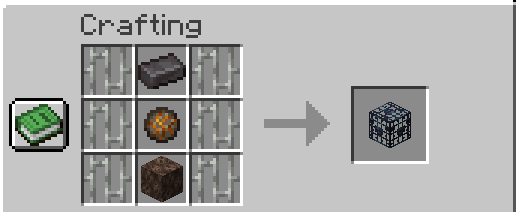
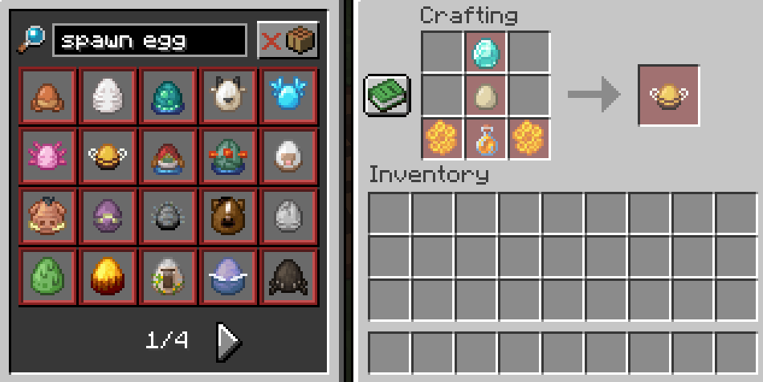
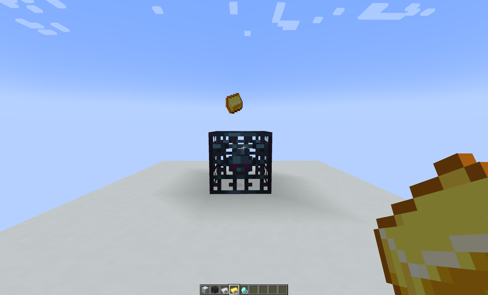
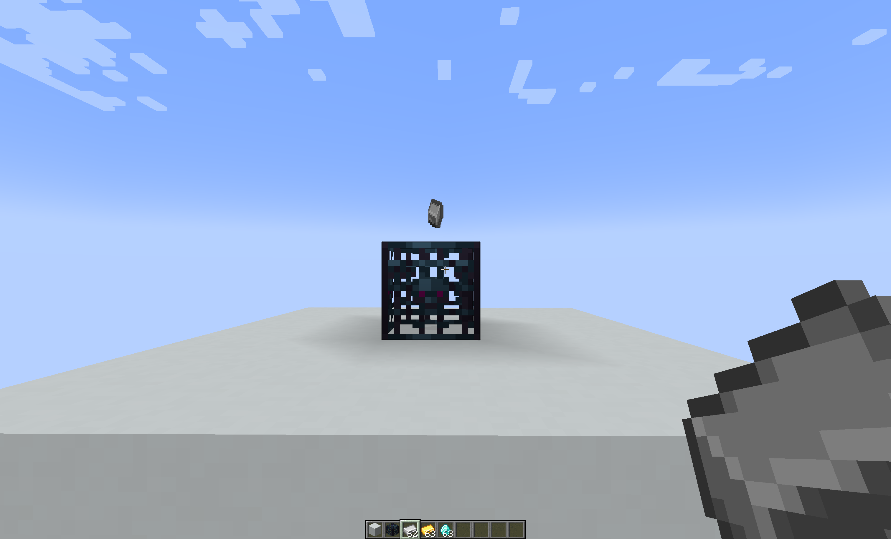
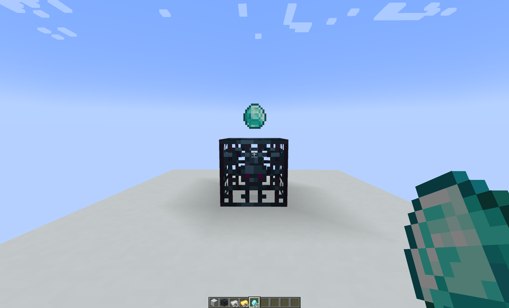

# Better Mob Spawners datapack [for Minecraft 1.20+]

## Description

This datapack was created to improve vanilla Minecraft functionality of mob spawners.
The solution is targeted for mid-game improvements.

Features added:

- craftable mob spawners
- craftable mob spawn eggs
- improving mob spawner delay (mobs appear more often)
- improving mob spawner required player range (spawner works at a larger distance)
- improving mob spawner spawn count (more mobs are spawned at a time)

## Craftable mob spawners

Recipe:

- 6 iron bars
- 1 soul sand
- 1 fire charge
- 1 netherite ingot

## Craftable mob spawn eggs

- 22 hostile mob spawn eggs
- 15 neutral mob spawn eggs
- 26 hostile mob spawn eggs

Recipes for crafting spawn eggs are automatically unlocked.

## Improving mob spawner delay

Increases how often a mob spawner spawns a group of mobs. This improvement has 3 tiers.
The default `minSpawnDelay` equals to 200, `maxSpawnDelay` equals to 800.

Improvement options:

- throw 1 gold ingot on top of a mob spawner to set `minSpawnDelay` and `maxSpawnDelay` to `200`
- throw 2 gold ingots on top of a mob spawner (improved to tier 1) to set `minSpawnDelay` and `maxSpawnDelay` to `150`
- throw 3 gold ingots on top of a mob spawner (improved to tier 2) to set `minSpawnDelay` and `maxSpawnDelay` to `100`

## Improving required player range

Increases the required range of how close a player needs to be to a mob spawner.
The default value is `16` blocks.

Improvement options:

- throw 1 iron ingot on top of a mob spawner to increase the distance to `24` blocks
- throw 2 iron ingots on top of a mob spawner (improved to tier 1) to increase the distance to `32` blocks
- throw 3 iron ingots on top of a mob spawner (improved to tier 2) to increase the distance to `64` blocks

## Improving spawn count

Increases the max number of mobs in a spawned group.
The default value is `4`.

Improvement options:

- throw 1 diamond on top of a mob spawner to increase the spawn count to `6`
- throw 2 diamonds on top of a mob spawner (improved to tier 1) to increase the spawn count to `8`
- throw 3 diamonds on top of a mob spawner (improved to tier 2) to increase the spawn count to `10`
